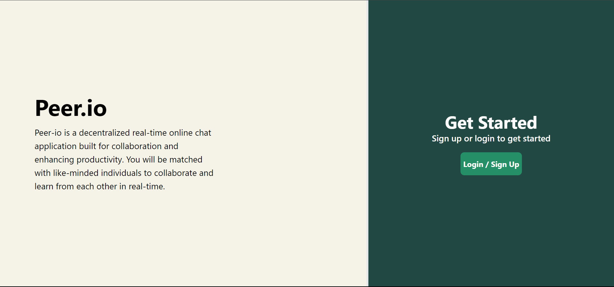
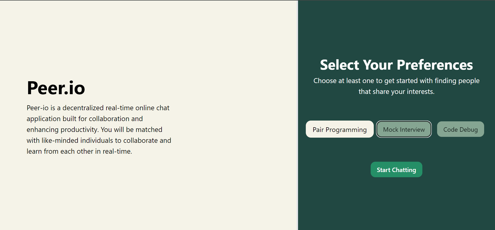
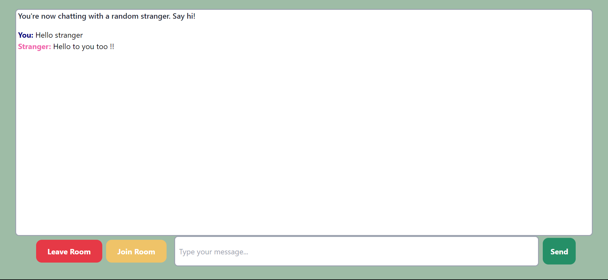

# Peer-io

## Project Overview:
Peer-io is a decentralized real-time online chat application built for collaboration and enhancing productivity. Select from various activities such as pair programming, mock interviews, code reveiws and more. You will be matched with like-minded individuals to collaborate and learn from each other in real-time. You can share your code, ask questions, and get instant feedback from your peers. Peer-io is built with a focus on privacy and security, so you can collaborate with confidence.
There are no servers involved in the process, so your data is never stored on any third-party servers. Peer-io uses WebSockets to establish a direct peer-to-peer connection between users, ensuring that your data is secure and private. Peer-io is a free and open-source project, and we welcome contributions from the community to help improve the platform.

##  Backend Repo 
[Peer-io Backend](https://www.github.com/pjparties/peer-io-backend)

## Demo:

## Usage:
Peer-io offers a simple and intuitive user interface for uploading and downloading files. Here's how to use it:
1. Open the Peer-io application in your web browser.
2. Sign up for an account or log in if you already have one.
3. Select Preferences and click on start Chat.
4. Once you are matched with a peer, you can start collaborating in real-time.

## Features:
- Decentralized chat platform
- Get matched with like-minded individuals
- Real-time collaboration
- Peer-to-peer communication
- Secure and efficient chats
- User-friendly interface

## Premium Version:
Peer-io offers a premium version with additional features, including:
- High priority matching
- Unlimited skips and matches
- Custom filters and preferences

## Version Info:
Current version: 0.1.1
Release date: February 27, 2024

## Installation:
To install Peer-io, follow these steps:
1. Clone the repository from GitHub: `git clone https://github.com/pjparties/peer-io-frontend.git`
2. Navigate to the project directory: `cd peer-io-frontend`
3. Install dependencies: `npm install`
4. Start the application: `npm run dev`

## Contributing:
We welcome contributions from the community to improve Peer-io. To contribute, follow these steps:
1. Fork the repository on GitHub.
2. Clone your forked repository to your local machine.
3. Create a new branch for your contribution: `git checkout -b feature/new-feature`
4. Make your changes and commit them: `git commit -m "Add new feature"`
5. Push your changes to your forked repository: `git push origin feature/new-feature`
6. Create a pull request on the original repository.
7. Our team will review your pull request and provide feedback.

## License:
This project is licensed under the [MIT License](LICENSE).
